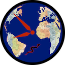
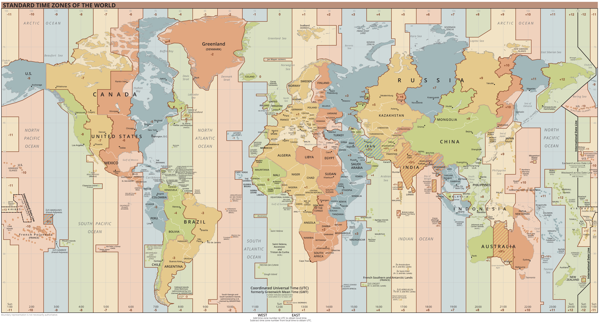

<div style="float:right"><a href="https://github.com/LittleGreenViper/LGV_TZ_Lookup">

</a></div>
<div style="float:left">

</div>
<div style="clear:both"></div>

# LGV_TZ_Lookup
A Server for Matching Long/Lat to Timezone

## Overview
This project is a fairly simple PHP project, designed to accept the GeoJSON output of [the Timezone Boundary Builder Project](https://github.com/evansiroky/timezone-boundary-builder), and provide a simple API, for matching longitude/latitude locations with timezones.

Send in a long/lat, and get back a string, with [the standard TZ time zone designator](https://en.wikipedia.org/wiki/List_of_tz_database_time_zones) of the timezone that covers that point.

[This is the GitHub repo for this project](https://github.com/LittleGreenViper/LGV_TZ_Lookup)

## What Problem Does This Solve?
Unfortunately, time zones are not a simple "I'm at this longitude, so it must be this time." They are political constructs.

Here's why we can't just do a simple longitude match:


[_Image Source: Wikimedia Commons_](https://commons.wikimedia.org/wiki/File:World_Time_Zones_Map.png)

We address this by using the rendered result of [this great project](https://github.com/evansiroky/timezone-boundary-builder), which is an effort to build a "living document" map of all the world timezones, as a shapefile (a file that can project polygons over a digital map), and locating a geographic point, within those shapes.

## How This Works
We provide a very basic PHP server that builds a simple database from the data in the massive shapefile (The [GeoJSON](https://geojson.org) variant that results from the timezone boundary builder. It can be found in any of [the project releases](https://github.com/evansiroky/timezone-boundary-builder/releases)). The database is deliberately "dumb," with a view towards making the project as flexible as possible, and lookups fast and easy.

Each timezone is described in [a GeoJSON polygon](https://datatracker.ietf.org/doc/html/rfc7946#section-3.1.6) (or [multipolygon](https://datatracker.ietf.org/doc/html/rfc7946#section-3.1.7)).

> NOTE: We are making _huge_ assumptions about the file. We assume that the polygons are very basic, "closed" polygons, and that multipolygons are simply aggregations of simple polygons (as opposed to making "holes," and whatnot).

We build a database of polygons (breaking up multipolygons), with what we term a "domain rect." This is a rectangle that encloses the entire polygon, regardless of the shape of the polygon.

The "domain rect" is used for a fast "triage" lookup. Its vertices are indexed in the database, so comparisons are zippy. We can quickly find the timezones that may contain our location, and ignore the rest.

In some cases, the domain rect "triage" may return only one result, so we got it in one. In other cases, we can then do a simple ["Winding Number"](https://en.m.wikipedia.org/wiki/Winding_number) lookup of the location, using the un-indexed polygon data for that timezone, and figure out which polygon actually has it. We return the first one.

From a usage standpoint, you simply send in a longitude/latitude pair, as a simple [HTTP GET](https://www.w3schools.com/tags/ref_httpmethods.asp), and you will receive a "raw" string response, with the [TZ](https://en.wikipedia.org/wiki/List_of_tz_database_time_zones) name of the timezone that applies to the location.

`http`_[_`s`_]_`://`_&lt;YOUR SERVER URL TO THE src DIRECTORY>[_`/index.php`_]_`?ll=`_]&lt;LONGITUDE>,&lt;LATITUDE>_

`https://tz.example.com?ll=-73.123,44.456`

The long/lat is sent as a comma-separated pair of floating-point numbers that represent degrees of longitude and latitude.

## Dependencies
This is a server project, designed for your classic ["LAMP"](https://en.wikipedia.org/wiki/LAMP_(software_bundle)) hosting, so you'll need to have a standard PHP/MySQL host.

This project uses [the streaming JSON parser](https://github.com/salsify/jsonstreamingparser), in order to parse [this file](https://github.com/evansiroky/timezone-boundary-builder/releases/download/2023b/timezones-with-oceans.geojson.zip) (a current release, at the time of this writing), which is [a GeoJSON file](https://geojson.org), containing the calculated timezones, and is created by [this project](https://github.com/evansiroky/timezone-boundary-builder).

Otherwise, it is a very basic [PHP](https://php.net) project (tested against [PHP 8.2](https://www.php.net/releases/8.2/en.php), at the time of this writing).

The initial release is built for [MySQL](https://www.mysql.com) (tested against [MySQL 5.7](https://downloads.mysql.com/archives/community/)), but uses [PHP PDO](https://www.php.net/manual/en/book.pdo.php), and has [an absurdly simple database schema](https://github.com/LittleGreenViper/LGV_TZ_Lookup/blob/5cb4aafac824b330c9181a2186ff3c89aac784f6/src/Sources/LGV_TZ_Lookup_Database.class.php#L65), so it can be expanded to other databases fairly easily.

Other than a [Composer](https://getcomposer.org) link to [the streaming JSON parser](https://github.com/salsify/jsonstreamingparser), there are no other dependencies.

### Batteries Not Included
Well...that's not _strictly_ true. You'll need to download the GeoJSON file from [the Timezone Boundary Builder Project releases](https://github.com/evansiroky/timezone-boundary-builder/releases). It's a big file, and may be updated, as timezones change. You can use either of the files (with or without oceans), but the project tests against the oceans variant.

## Implementation

### Initial Installation
Once you have a server available, install the contents of the [`src` subdirectory](https://github.com/LittleGreenViper/LGV_TZ_Lookup/tree/main/src) in a place of your choosing, accessible via HTTP. You should have a URI that points to the [`index.php` file](https://github.com/LittleGreenViper/LGV_TZ_Lookup/blob/main/src/index.php) in the [`src` directory](https://github.com/LittleGreenViper/LGV_TZ_Lookup/tree/main/src).

### Database Setup
You will need to set up a MySQL database, with a user with basic full permissions.

### Config File
A requirement for the server is a configuration file. It should generally be placed outside the HTTP-accesible directory tree, and you will need to modify the line in the [`index.php`](https://github.com/LittleGreenViper/LGV_TZ_Lookup/blob/f9914c89e8484522732100ea82f8b1cab8c667f6/src/index.php#L51) file that looks like this:

`define("__CONFIG_FILE_", __DIR__.'/../../../../TZInfo/config.php');`

To point to the configuration file.

The contents of the configuration file will look like this:

```
<?php 
    $g_dbName = "<DATABASE NAME>";
    $g_dbUserName = "<DATABASE USERNAME>";
    $g_dbPassword = "<DATABASE USER PASSWORD>";
    $g_dbType = "<DATABASE TYPE>";
    $g_dbHost = "<DATABASE HOST>";
    $g_dbPort = "<DATABASE PORT>";
    $g_server_secret = "<SERVER SECRET>";
```

with each of the strings changed to match the configuration. Here's an example:

```
<?php 
    $g_dbName = "HostingHash_TZDB";
    $g_dbUserName = "tzUser";
    $g_dbPassword = "swordfish";
    $g_dbType = "mysql";
    $g_dbHost = "127.0.0.1";
    $g_dbPort = "3306";
    $g_server_secret = "Shh-Dont-Tell-Anyone";
```

That `$g_server_secret` is important, if you don't want "just anyone" accessing the server. If it is set to a string, then every call to the server (including the command line) will need to have a `secret=<SERVER SECRET>` query argument added to the regular query, like so:

#### HTTP Request:
`https://tz.example.com/index.php?secret=Shh-Dont-Tell-Anyone&ll=-73.123,44.456`

#### Command Line:
`?> php`_&lt;PATH TO THE src DIRECTORY>_`/index.php secret=Shh-Dont-Tell-Anyone load`

### Composer
Once the directory is in place, you'll need to update composer, to bring in the dependency.

```(bash)
$> cd <YOUR src DIRECTORY>
$> composer update
```

That will set up a `vendor` subdirectory. Just ignore it, after that. The server knows where to get it.

>NOTE: The dependency is only required for the load and setup. It is not required for subsequent queries.

### The Data File
You'll need to fetch the GeoJSON data file from [the Boundary Builder Project Releases Directory](https://github.com/evansiroky/timezone-boundary-builder/releases). Get the latest release, and look for files named `timezones.geojson.zip`, or `timezones-with-oceans.geojson.zip`.

They are pretty big files.

Unzip the file into the `src` directory.

>NOTE: We have the project initially set up for the `combined-with-oceans.json` file. If you want to use the `combined.json` file, instead, then you should edit the [`index.php`](https://github.com/LittleGreenViper/LGV_TZ_Lookup/blob/f9914c89e8484522732100ea82f8b1cab8c667f6/src/index.php#LL113C14-L113C14) file at the line that looks like this:

```(php)
    $stream = fopen("$path/combined-with-oceans.json", 'r');

```

so that it looks like this:

```(php)
    $stream = fopen("$path/combined.json", 'r');

```

>CAUTION: If you do this, some of the tests won't pass!

### The Initial Load and Database Setup
You don't need to "prime" the database. The server will take care of creating the table.

However, the initial load can only be done via command-line, so you'll need to SSH into the server, and run the load from there. You use the syntax indicated above:

```(bash)
$> php <YOUR src DIRECTORY>/index.php server=<SERVER SECRET> load
```

This can take a while.

Upon success, the script emits a simple `1`. If there was a problem, it emits a `0`.

Once that's done. the server is ready to go. You can even delete the JSON file and the vendor directory, if you want, but they will need to be back, before you can load.

You won't need to run `load` very often, so it shouldn't be in a `cron` job, or anything.

All interactions from then on, are done via HTTP.

### Testing
We have a set of simple tests that can be run. They send in known coordinates, and ensure that the server returns the proper response.

You run the tests, like so:

`https://tz.example.com`_[_`/index.php`_]_`?`_[_`secret=<SERVER SECRET>&`_]_`test`

You will get a simple HTML page, with each of the tests, listed. If the test passes, the title will be green. If it fails, the title will be red, and there will be a list of links to failures, at the top of the page.

Everything should be green (unless you swapped out the JSON file, in which case, you'll need to look for the failures, and validate the tests).

## License
This is an [MIT-Licensed](https://opensource.org/license/mit/) project.
