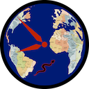
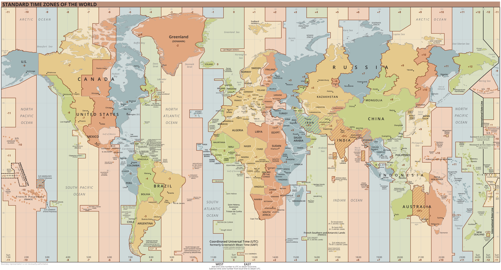

# LGV_TZ_Lookup

A small PHP library that turns longitude and latitude into an IANA time zone name, such as `America/New_York`. Use it in your application through Composer, or run it as a simple HTTP service.

Requires **PHP 8.0+**, **PDO**, and **MySQL or PostgreSQL** with a loaded boundary database. Boundary data comes from the [Timezone Boundary Builder project](https://github.com/evansiroky/timezone-boundary-builder).

## What Problem Does This Solve?

Unfortunately, time zones are not a simple "I'm at this longitude, so it must be this time." They are political constructs.

Here's why we can't just do a simple longitude match:


[_Image Source: Wikimedia Commons_](https://commons.wikimedia.org/wiki/File:World_Time_Zones_Map.png)

We address this by using the rendered result of [this great project](https://github.com/evansiroky/timezone-boundary-builder), which is an effort to build a "living document" map of all the world timezones, as a shapefile (a file that can project polygons over a digital map), and locating a geographic point, within those shapes.

## Composer Library

Run these commands in your application's directory:

```bash
composer config repositories.lgv-tz-lookup vcs https://github.com/LittleGreenViper/LGV_TZ_Lookup.git
composer require littlegreenviper/lgv_tz_lookup:^1.4
```

Then look up a location:

```php
<?php
require __DIR__.'/vendor/autoload.php';

$database = new LGV_TZ_Lookup_Database(
    'tz_database', 'tz_reader', 'your-db-password', 'mysql', '127.0.0.1'
);
$lookup = new LGV_TZ_Lookup_Query($database);

echo $lookup->get_tz(-77.036543, 38.895037); // America/New_York
```

Pass **longitude first**, then latitude, in degrees. The result is a time zone name, or an empty string if no match is found. You can reuse the lookup object for multiple locations.

For PostgreSQL, use `pgsql` instead of `mysql`. Ports default to `3306` and `5432`, respectively; an optional sixth constructor argument selects another port. Install the PDO extension for your chosen database.

### Initial Boundary Loading

Populate the `timezones` table once before making lookups, or import it from an existing installation. The [initial loading instructions](docs/guide.md#loading-boundaries-for-a-library-application) show how to load the downloaded GeoJSON file into your database. Lookup needs only `SELECT` access afterward.

The streaming JSON parser is an optional dependency used only for loading. The boundary file is downloaded separately and is not bundled with the library.

## One-Command Server Deployment

To run an HTTP service, start the installer from a checkout:

```bash
./deploy.sh
```

It asks for database and server settings, downloads and loads the latest boundaries, tests the lookups, and installs the endpoint. A random server secret is enabled by default. The final output gives you the secret and a request URL, such as:

```text
https://your-server/timezone/?ll=-77.036543,38.895037&secret=<YOUR SECRET>
```

Enter an existing web directory's filesystem path and the public URL that maps to that directory. The installer appends the service subdirectory (default `timezone`) to both. It prints the complete service, lookup, and test URLs, including any existing URL prefix. Use those URLs to access the installed service.

New installations accept a new or empty private application directory outside the web tree. The empty-directory fix is newer than 1.4.2; with that release, choose a new subdirectory inside the existing empty directory, or use the updated installer worker. See [directory choices](docs/guide.md#choosing-the-web-directory-and-service-subdirectory).

Use `./deploy.sh --no-secret` for public access. You need an existing PHP-enabled web server and database service. See the [deployment guide](docs/guide.md#deploying-a-server) for prerequisites, directory choices, and recovery.

Starting with **1.4.2**, rerun the updated `./deploy.sh` with the same database settings, public service directory, and private directory to refresh an installer-owned service. It retains the existing boundaries, configuration, and secret. See [upgrading an existing installation](docs/guide.md#upgrading-an-existing-installation). The printed test URL now includes lookup timing and PHP memory metrics.

### What to Copy to the Server

Run `./deploy.sh` **on the server** to have the installer create the public endpoint and private application. You can transfer a checkout first, or use the guide's download command.

For a manual transfer, run `composer install` at the repository root, then copy these items into one **private application directory outside the web root**, preserving their relative paths:

- `composer.json`, `composer.lock`, `vendor/`, and `LICENSE`.
- `src/Sources/`, `src/index.php`, `src/LGV_TZ_Lookup_Test.php`, and `src/TestLocations.php`.
- `update.sh`, `tools/update.php`, and `tools/Setup.php`.

Follow the [step-by-step installation guide for MySQL or PostgreSQL](docs/guide.md#step-by-step-server-installation) to create the database, copy the files, configure the private application and public endpoint, load boundaries, and verify the service. The [exact file list and server layout](docs/guide.md#step-4-copy-the-application-files) show where each item belongs. Composer files and `vendor/` belong only at the application root. Keep `vendor/` for future boundary updates. Documentation, demos, development tests, and downloaded boundary files are not part of the server copy.

## Updating the Boundary Data

Version **1.4.1** adds a simple updater. From a checkout:

```bash
./update.sh --check                         # Print the latest boundary release version.
./update.sh /absolute/path/to/config.php    # Download and load it into your existing database.
```

Use the same private configuration as your server. New server deployments include `update.sh` beside `config.php`, so the installed script can run without a path argument.

The updater reports the boundary version and polygon count, and deletes the downloaded ZIP and GeoJSON afterward. It loads the new data before replacing the live table, so a failed load retains your existing boundaries. Each update command reloads the latest release; `--check` lets you decide whether to run it.

See the [updater guide](docs/guide.md#updater-details) for requirements, options, and cleanup recovery.

## Try the Demo

From a checkout, with PHP and a running MySQL or PostgreSQL server:

```bash
./demo/run.sh
```

The demo installs the library, downloads boundaries, creates a temporary database, and runs the lookup tests. It removes that database and its downloads afterward. See [demo setup and options](docs/guide.md#turnkey-command-line-demo), including how to test a local checkout or select PostgreSQL.

## More Information

- [Detailed usage guide](docs/guide.md): loading, server setup, updates, demos, and development.
- [API documentation](https://littlegreenviper.github.io/LGV_TZ_Lookup/): classes and source reference.
- [Changelog](CHANGELOG.md): release history.

For development, run `composer install` and `composer test` in the repository root. Rebuild the HTML documentation with `./generate-docs.sh`; [build instructions](docs/guide.md#generating-the-html-documentation) cover prerequisites and previewing.

## License

[MIT](LICENSE), © Little Green Viper Software Development LLC.
